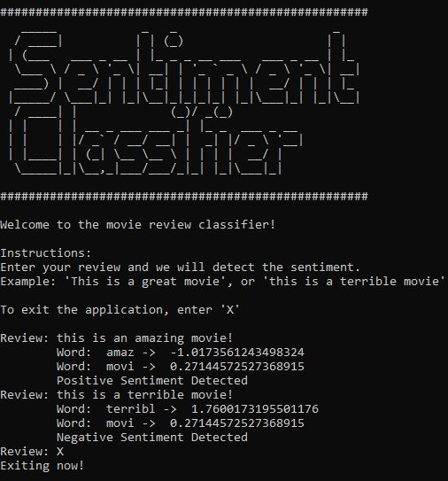

### Assignment 1: Naive Bayes Sentiment Classifier


#### Files and Directories:

- text_classification_module: Directory with module data
  - text_classifier.py: Deliverable which can be executed via ```python text_classifier.py```
  - artifacts: Directory with artifacts
    - loglikelihood.json: File with the Naive Bayes output in the form of loglikelihoods
- CS6120_NLP_Assignment_1_Notebook.ipynb: Completed assignment
- movie_reviews.csv: Raw dataset for the movie reviews
- images: Directory of images
- requirements.txt: List of all requirements that need to be installed


#### Instructions:
Installing libraries:
    - Install the required libraries using ```pip install requirements.txt```

IPython Notebook:
   - You can access the ```CS6120_NLP_Assignment_1_Notebook.ipynb``` using Jupyter Lab or notebook

Module:
- You can type ```python text_classifier.py``` to run the program
  - You will see the following in your command line:
  
  
